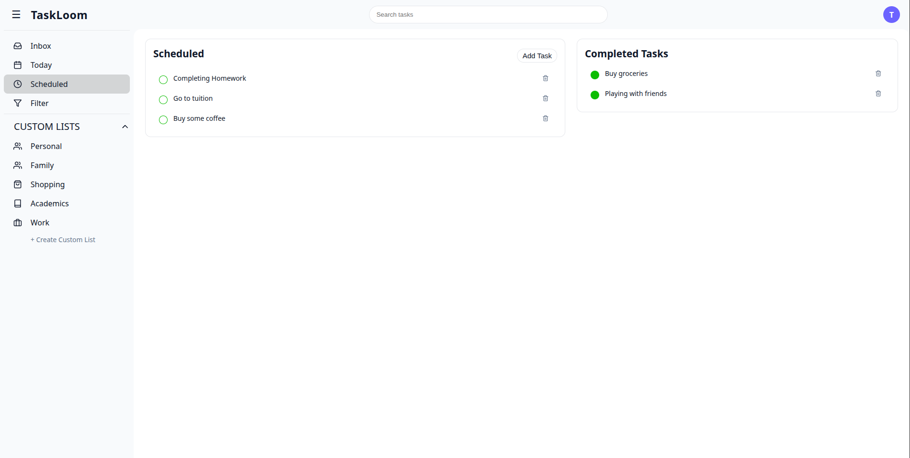

# 🚀 TaskLoom - React Task Management App

TaskLoom is a modern task management web application built using React.  
It allows users to manage daily tasks with a clean UI, dark/light mode support, and a separate animated login page.

---
## Main Page

<p align="center">
  
</p>

## Login Page

<p align="center">
  
</p>

## ✨ Features

### 🗂 Task Management
- Add new tasks
- Delete tasks
- Mark tasks as completed
- View completed tasks separately
- Real-time task search filtering

### 📁 Sidebar Navigation
- Inbox
- Today
- Scheduled
- Custom Lists (Personal, Family, Work, etc.)
- Collapsible sidebar

### 🌙 Theme Support
- Light mode
- Dark mode
- Smooth theme switching

### 🔐 Authentication UI
- Separate Login & Sign Up page
- Animated sliding panel design
- Social login icons
- Fully scoped CSS (no layout leakage)

---

## 🖥️ UI Overview

- Clean dashboard layout
- Modern card-based design
- Responsive sidebar
- Gradient animated login screen
- Minimal and elegant styling

---

## 🛠️ Tech Stack

| Technology | Purpose |
|------------|----------|
| React | Frontend framework |
| React Router | Page routing |
| React Icons | Social media icons |
| CSS3 | Styling |
| Flexbox & Grid | Layout |
| JavaScript (ES6+) | Logic & state management |

---

#🚀 How to Run Locally

Follow these steps to run the project on your local machine.

### 1️⃣ Clone the repository
```bash
git clone https://github.com/sukantadutta2003-tech/taskloom.git
cd taskloom
```

### 2️⃣ Install dependencies

Make sure you have Node.js (v16 or higher) installed.

```bash
npm install
```

### 3️⃣ Start the development server

```bash
npm start
```

### 4️⃣ Open in browser

Once the server starts, open:

```bash
http://localhost:3000
```
---

## 🛠 Requirements
- Node.js (v16+ recommended)
- npm or yarn
- Modern browser (Chrome, Edge, Firefox)

---

🎯 Future Improvements

- Add more interesting features
- Clean UI
- AI ChatBox

---

📜 License

This project is open-source and free to use for educational purposes.

---

👨‍💻 Author

Sukanta Dutta
Aspiring Full Stack & Software Developer
